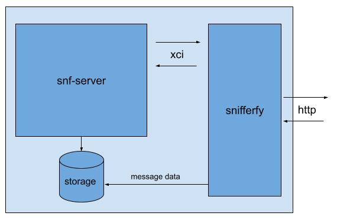

# snifferfy
A simple web proxy for sniffer written in go
## How it works
Snifferfy sets up a web server that translates multipart form POSTs into sniffer XCI calls and returns json-formatted results to the web client.



# Build
`env GOOS=linux GOARCH=amd64 go build -o bin/snifferfy_0.0.1_linux_amd64`


# Run
## Configuration
* `SNFPORT` (default: 9001)
* `HTTPPORT` (default: 8080)
* `WORKINGDIR` (default: /usr/share/snf-server/storage/)
* `LOGLEVEL` (default: info)

## Endpoints

* `/health` : health check endpoint for snifferfy / sniffer. returns 500 if there's an error while connecting to sniffer on xci
* `/status` : translates the [report xci interface](http://www.armresearch.com/Documentation/QA/snfxcireport-1283695785.jsp): 
* * input: interval
* * accepted values: second, minute, hour
* `/scan` : translates the [scanner xci interface](http://www.armresearch.com/Documentation/QA/snfxciscanner-1956222249.jsp)
* * input: file, ip (optional), logEnable [yes/no (default: yes)], xhdrEnable [yes/no (default: no)]
* `/testip` : translates the [gbudb testip xci interface](http://www.armresearch.com/Documentation/QA/xci_gbudb_test_format--572797157.jsp)
* * input: ip


## Example Output

### health
```
curl -s localhost:8080/health

{"result": alive}
```

### status
```
curl -F 'interval=second' -s localhost:8080/status

{"Stats":{"NodeId":"ouqpmlwq","Basetime":20210226151406,"Elapsed":1000,"Class":"second","Version":{"Engine":"SNFMulti Engine Version 3.2.1 Build: Apr 18 2016 18:17:39","Platform":"SNF Server Version 3.2.0 Build: Apr 18 2016 18:17:21"},"Timers":{"Run":{"Started":20210226150724,"Elapsed":403},"Sync":{"Latest":19700101000000,"Elapsed":1614352447},"Save":{"Latest":19700101000000,"Elapsed":1614352447},"Condense":{"Latest":19700101000000,"Elapsed":1614352447}},"Gbudb":{"Size":{"Bytes":8388608},"Records":{"Count":3},"Utilization":{"Percent":0.0488281}},"Rules":{"Rulesbase":{"Utc":0},"Active":{"Utc":20210226150715},"Update":{"Ready":"no","Utc":0},"Latest":{"Rule":"1607360"}}}}
```
### scan
```
curl -F 'file=@data/0000A37A-8927-4C34-AC1D-E61F0357B3A1.1' -s localhost:8080/scan

{"Code":52,"Xhdr":"","Log":{"Scan":{"TimeStamp":20210226150740,"Message":"/usr/share/snf-server/storage/489960822","Result":52,"RuleId":1607360,"Performance":{"SetupTime":0,"ScanTime":11,"Bytes":2112,"Evaluators":211},"Gbudb":{"Ordinal":1,"Ip":"45.143.80.23","Flag":"u","Confidence":0,"Probability":0,"Result":"New"}}}}
```

### testip
```
curl -F "ip=19.1.1.1" -s localhost:8080/testip
{"Ip":"19.1.1.1","Type":"ugly","Range":"new","Code":0,"Probability":0,"Confidence":0,"Bad":0,"Good":0}
```

## Resources
http://www.armresearch.com/Documentation/index.jsp